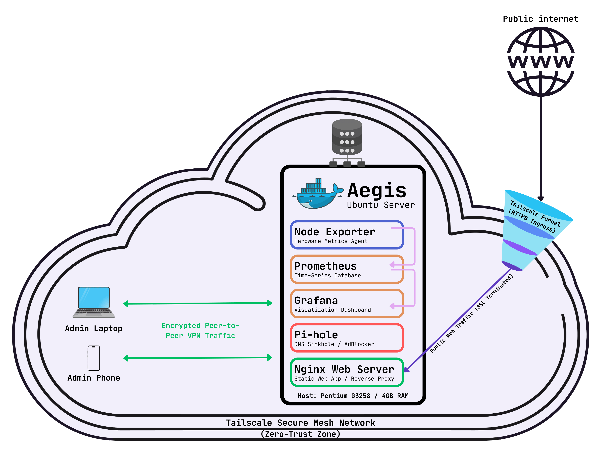
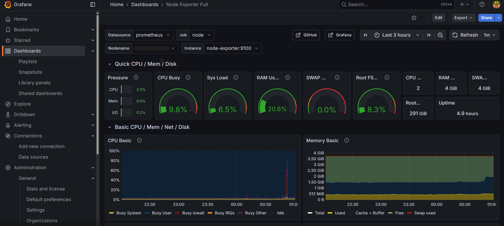
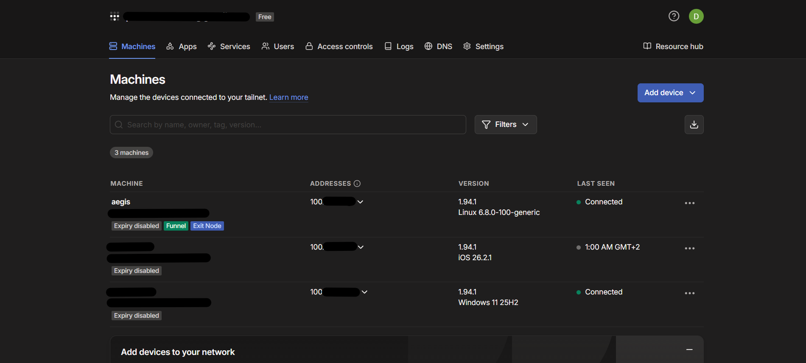
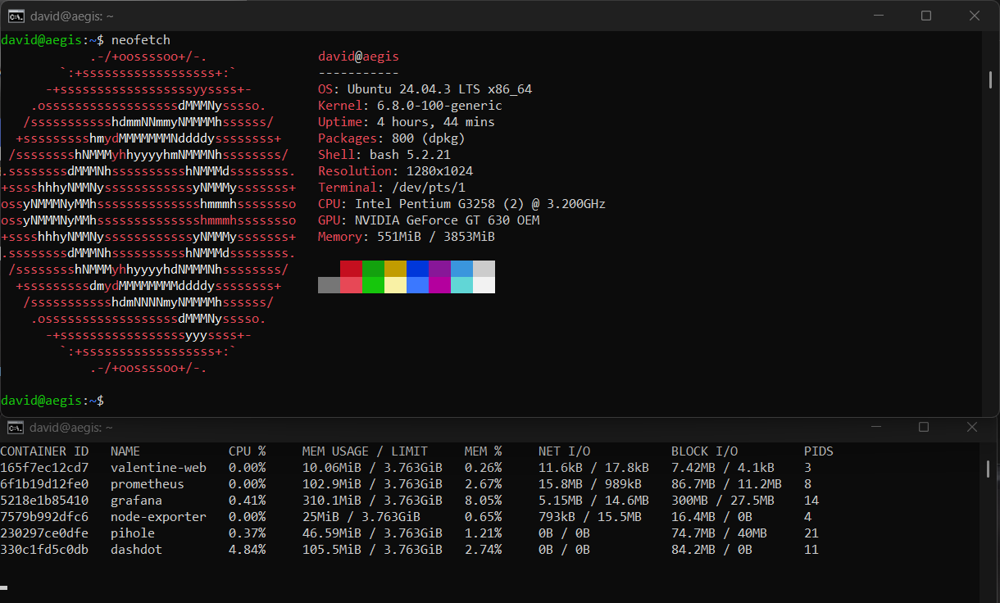

# Aegis: My Over-Engineered Home Lab

### Hi, I'm David 
I'm a Cybernetics Student at ASE Bucharest with a passion for DevOps and Infrastructure.

"Aegis" is my attempt to build a production-grade infrastructure on hardware that belongs in a museum. Instead of paying for cloud credits, I wanted to learn how to secure, monitor, and automate a server from scratch, dealing with real-world constraints like limited RAM and CPU cycles.



---

## Why I built this?
I wanted to move beyond "it works on my machine." My goal was to create a server that is:
1.  **Secure by default** (Zero-Trust, no open ports).
2.  **Self-healing** (Automated maintenance).
3.  **Visible** (If it breaks, I want to see a graph of *why*).


## The Hardware (The Real Challenge)
The heart of this operation is an **Intel Pentium G3258** with **4GB of RAM**.
Running a full monitoring stack + web services on a dual-core CPU from 2014 forced me to be extremely efficient with Docker resource limits and image optimization.


## Architecture & Tech Stack

Everything runs on **Ubuntu Server**, orchestrated via **Docker Compose**.


## Proof of Concept

### 1. Observability (Grafana Dashboard)
*Real-time metrics showing CPU usage and memory optimization on the 4GB RAM host.*


### 2. Zero-Trust Network (Tailscale Mesh)
*Aegis connected securely via VPN, isolated from public internet exposure.*


### 3. Resource Management
*Running 6 containers with <600MB total system RAM usage. Evidence of optimization on legacy hardware.*



### Security & Networking (Zero-Trust)
I didn't want to expose my home router to the internet via Port Forwarding. It felt unsafe.
* **Tailscale Mesh VPN:** I set up a mesh network where devices connect directly (peer-to-peer).
* **ACLs (Access Control Lists):** I configured strict rules. My phone can see the dashboard, but public traffic can *only* hit the specific web container.
* **The "Funnel":** I use Tailscale Funnel as an ingress controller to expose internal apps securely via HTTPS without messing with dynamic DNS or router configs.

---

### 🛡️ Security Update [03/03/2026] Aegis Hardening Phase
To transition from a functional lab to a production-grade "Hardened" infrastructure, I implemented **Defense in Depth** principles to protect the Pentium's limited resources from external threats:

* **Service Isolation (Localhost Binding):** All internal management tools (Grafana, Prometheus, Pi-hole Admin, Dashdot) are now bound exclusively to `127.0.0.1`. This makes them invisible to network scans, even within the local network or VPN mesh.
* **Immutable Infrastructure:** The Nginx container (`valentine-web`) now operates with a `read_only` filesystem and `no-new-privileges:true`. This ensures that even if a web vulnerability is exploited, the attacker cannot write malicious files or escalate privileges.
* **SSH & Active Defense:** I've moved SSH to port `44222` and enforced ED25519 Key-only authentication. To handle persistent threats, **Fail2Ban** is configured as a digital bouncer, automatically null-routing any IP that fails to authenticate 3 times.

#### Accessing the Vault (SSH Tunneling)
Since the control panels are "locked" inside the host, I use **SSH Port Forwarding** to access them securely from my laptop:

```bash
# To access Grafana (http://localhost:3000)
ssh -L 3000:localhost:3000 -p 44222 david@aegis

# To access Pi-hole Admin (http://localhost:8081/admin)
ssh -L 8081:localhost:80 -p 44222 david@aegis
```

---

### Observability (My Favorite Part)
I need to know if the Pentium is melting.
* **Prometheus** scrapes metrics every 15 seconds.
* **Grafana** visualizes CPU load, RAM usage, and container health.
* **Node Exporter** gives me the raw hardware data.


### Automation
I wrote Bash scripts (managed by Cron) to handle the boring stuff:
* `maintenance.sh`: Automatically updates system packages and cleans up unused Docker images/volumes to save disk space.
* Log rotation ensures the drive doesn't fill up overnight.

---

## "It works now, but..." (Challenges I faced)
* **The "OOM" Killer:** Initially, Grafana + Prometheus ate all the RAM. I had to tweak the scraping intervals and retention policies to make it stable on 4GB.
* **Public Access:** I wanted to host a static site for a project (Valentine's Day surprise), but keeping it secure was tricky. I used **Tailscale Funnel** to isolate that specific container from the rest of my internal network.


## How to run it
If you have an old laptop or PC gathering dust, here is how you can replicate my stack:

```bash
# Clone the repo
git clone [https://github.com/Puiutmic/aegis-infrastructure.git](https://github.com/Puiutmic/aegis-infrastructure.git)

# Spin up the containers
docker compose up -d
```
